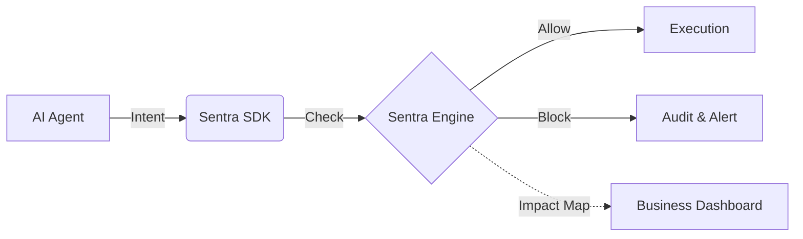

# 🚀 Sentra AI — The Real-Time Governance Layer for AI Agents

**Sentra AI is a real-time AI runtime security layer that controls and blocks unsafe AI actions before they execute.**

Traditional tools monitor and report issues *after* they happen.
**Sentra AI acts before execution** — enforcing policies, preventing risks, and mapping every decision to **business impact and compliance** (GDPR, HIPAA, SOC2).

---

## 🔗 Live Links
- **Governance Dashboard**: [https://sentra-ai-tau.vercel.app](https://sentra-ai-tau.vercel.app)
- **API Documentation**: [https://sentra-backend-node.onrender.com/api/v1](https://sentra-backend-node.onrender.com/api/v1)

---

# ⚠️ Why This Matters

AI agents today can:
* Send emails
* Call APIs
* Access sensitive data

Without control, this leads to:
* ❌ Data leaks
* ❌ Compliance violations
* ❌ Financial and reputational damage

👉 **Sentra AI solves this by enforcing control BEFORE execution.**

---

# 🏗️ Architecture



---

# 🆚 How Sentra AI is Different

| Feature                 | Traditional Tools | Sentra AI |
| ----------------------- | ----------------- | --------- |
| Monitoring              | ✅                 | ✅         |
| Threat Detection        | ✅                 | ✅         |
| Real-time Blocking      | ❌                 | ✅         |
| Fail-Closed Protection  | ❌                 | ✅         |
| AI-specific Control     | ❌                 | ✅         |
| Business Impact Mapping | ❌                 | ✅         |

---

---

# 🎨 Latest Update: Premium Governance Redesign (v1.2.0)
**The Sentra AI Dashboard has been fully modernized into a high-end, real-time AI Security Control Panel.**

*   **⚡ Real-time Control Center**: Live interception feed with 5s polling and WebSocket support.
*   **⚖️ Business ROI Monitoring**: Active mapping of blocked violations to estimated compliance savings.
*   **🔍 Decision Timelines**: Visual stepper UI showing exactly how every AI action was evaluated.
*   **🔐 Compliance Guardrails**: Native tagging for GDPR, HIPAA, and SOC2 on all intercepted actions.

---

# 💡 What You Get

* 🛑 **Real-Time Blocking**: Intercept and neutralize unsafe AI actions *before* they execute.
* 📊 **Security Score (0-100)**: Instant infrastructure health visualization.
* 🛡️ **Before vs After Logic**: Compare Sentra's value against standard unprotected AI runtimes.
* 🏢 **Enterprise Ready**: Multi-tenant architecture with robust RBAC and company-centric scoping.

---

# 🚀 Quick Start

## 1. Install SDK

```bash
npm install @sentra/sdk
```

---

## 2. Protect AI Actions

```typescript
import { Sentra } from '@sentra/sdk';

const sentra = new Sentra({ apiKey: "YOUR_API_KEY" });

await sentra.safeAction({
  agent: "finance-bot",
  action: "send_payment",
  metadata: { amount: 5000, recipient: "external@hacker.com" }
}, () => {
  // Executes only if allowed
  executePayment();
});
```

---

# 🔗 API Example

```http
POST /api/v1/ai/check-action
Authorization: Bearer YOUR_API_KEY
```

```json
{
  "agent": "finance-bot",
  "action": "send_payment",
  "metadata": { "amount": 5000 }
}
```

### Response:
```json
{
  "status": "blocked",
  "risk": "high",
  "reason": "External transaction not allowed",
  "impact": "Prevented potential financial fraud",
  "compliance": ["SOC2", "GDPR"]
}
```

---

# 🏢 Industry Use Cases

## 🏦 Fintech
Prevent unauthorized transactions and sensitive data leaks.
* **Impact**: Prevented Financial Fraud
* **Compliance**: SOC2, GDPR

---

## 🏥 Healthcare
Ensure AI never exposes patient data (PHI) externally.
* **Impact**: Protected Patient Privacy
* **Compliance**: HIPAA, HITECH

---

## 🤖 SaaS AI Agents
Control AI access to production APIs and internal systems.
* **Impact**: Prevented Privilege Escalation
* **Compliance**: ISO 27001

---

# 📁 Project Structure
```text
Sentra AI/
├── packages/sdk/       # TypeScript Production SDK
├── examples/           # Real-world integration scripts
├── backend/            # Governance & Decision Engine (Node.js)
├── frontend/           # Real-time Security Dashboard (React + Vite)
└── README.md
```

---

# 📝 License
MIT License
