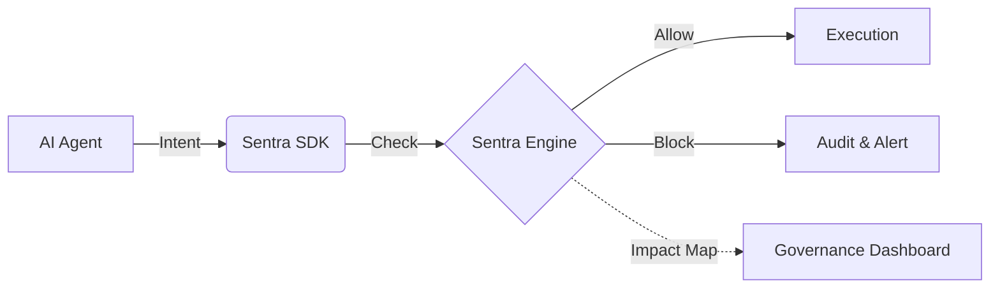

# 🚀 Sentra AI — The Real-Time Governance Layer for AI Agents

**Sentra AI is a real-time AI Governance & Compliance Operating System that controls and blocks unsafe AI actions before they execute.**

Traditional tools monitor and report issues *after* they happen.
**Sentra AI acts before execution** — enforcing policies, preventing risks, and mapping every decision to **human-readable governance insights and compliance impact** (GDPR, HIPAA, DPDP).

---

## 🔗 Live Links
- **Governance Dashboard**: [https://sentra-ai-88f7.vercel.app](https://sentra-ai-88f7.vercel.app)
- **API Documentation**: [https://sentra-backend-node.onrender.com/api/v1](https://sentra-backend-node.onrender.com/api/v1)

---

# ⚠️ Why This Matters

AI agents today can:
* Send emails
* Call APIs
* Access sensitive data

Without control, this leads to:
* ❌ Data leaks
* ❌ Compliance violations
* ❌ Financial and reputational damage

👉 **Sentra AI solves this by enforcing control BEFORE execution.**

---

# 🏗️ Architecture



---

# 🆚 How Sentra AI is Different

| Feature                 | Traditional Tools | Sentra AI |
| ----------------------- | ----------------- | --------- |
| Monitoring              | ✅                 | ✅         |
| Threat Detection        | ✅                 | ✅         |
| Real-time Blocking      | ❌                 | ✅         |
| Fail-Closed Protection  | ❌                 | ✅         |
| AI-specific Control     | ❌                 | ✅         |
| Business Impact Mapping | ❌                 | ✅         |

---

# 🏛️ Latest Update: Enterprise Governance OS (v1.5.0)
**The Sentra AI platform has been fully transformed into an enterprise-grade Governance Control system.**

*   **🎭 Live Demo Simulation**: Interactive demo mode with real-time scenarios for **Finance**, **Healthcare**, and **SaaS Hubs**.
*   **⚖️ Deterministic Policy Engine**: Every AI action is mapped to specific **AI Guardrails** (e.g., *Restrict External Data Sharing*).
*   **🔐 Audit-Ready Overrides**: Hardened manual intervention workflow with mandatory **Employee ID** and **Justification** audit trails.
*   **📊 Compliance Impact System**: Active mapping of violations to regulatory impact (e.g., *"Reduced GDPR score by 2%"*).
*   **⚡ Operational Transparency**: Real-time "Last Updated" counters and pulsing "Active" policy status.

---

# 🛡️ Security Audit & Hardening (v1.6.0)
**Sentra AI has undergone a full security audit to meet enterprise-grade compliance standards.**

*   **🚫 Zero-Trust Role Management**: Registration logic hardened to prevent privilege escalation. Users can no longer self-assign `ADMIN` roles.
*   **🔐 Fail-Safe Secret Management**: Removed hardcoded fallback secrets. The system now enforces environment-level encryption for JWTs.
*   **🛑 Brute-Force Mitigation**: Strict rate limiting implemented on all authentication and sensitive management endpoints (10 attempts / 15 mins).
*   **🌐 Production-Locked CORS**: Cross-origin policies are strictly locked to production domains, preventing unauthorized cross-site scripting and data theft.
*   **📜 Structured Audit Logging**: Enhanced production logging with JSON serialization for integration with SIEM tools (Datadog, Splunk).

---

# 💡 What You Get

* 🛑 **Real-Time Blocking**: Intercept and neutralize unsafe AI actions *before* they execute.
* 🛡️ **AI Guardrails**: Centralized policy management with pulse-status monitoring.
* 📊 **Compliance OS Dashboard**: Minimal, high-density visualization of enterprise risk.
* 🏢 **Enterprise Ready**: Multi-tenant architecture with robust RBAC and company-centric scoping.

---

# 🚀 Quick Start

## 1. Install SDK

```bash
npm install @sentra/sdk
```

---

## 2. Protect AI Actions

```typescript
import { Sentra } from '@sentra/sdk';

const sentra = new Sentra({ apiKey: "YOUR_API_KEY" });

await sentra.safeAction({
  agent: "finance-bot",
  action: "send_payment",
  metadata: { amount: 5000, recipient: "external@hacker.com" }
}, () => {
  // Executes only if allowed
  executePayment();
});
```

---

# 🔗 API Example

```http
POST /api/v1/ai/check-action
Authorization: Bearer YOUR_API_KEY
```

```json
{
  "agent": "finance-bot",
  "action": "send_payment",
  "metadata": { "amount": 5000 }
}
```

### Response:
```json
{
  "status": "blocked",
  "risk": "high",
  "reason": "External transaction not allowed",
  "impact": "Reduced GDPR score by 2%",
  "compliance": ["GDPR", "SOC2"]
}
```

---

# 🏢 Industry Scenarios (Demo Ready)

## 🏦 Finance Center
Prevent unauthorized transactions and sensitive data leaks.
* **Focus**: Anti-Fraud & Ledger Integrity
* **Compliance**: SOC2, GDPR

---

## 🏥 Healthcare Hub
Ensure AI never exposes patient data (PHI) externally.
* **Focus**: PHI Protection & Privacy
* **Compliance**: HIPAA, HITECH

---

## 🤖 General SaaS
Control AI access to production APIs and internal systems.
* **Focus**: Privilege Escalation & Data Drift
* **Compliance**: ISO 27001

---

# 📁 Project Structure
```text
Sentra AI/
├── packages/sdk/       # TypeScript Production SDK
├── examples/           # Real-world integration scripts
├── backend/            # Governance & Decision Engine (Node.js)
├── frontend/           # Real-time Security Dashboard (React + Vite)
└── README.md
```

---

# 📝 License
MIT License
