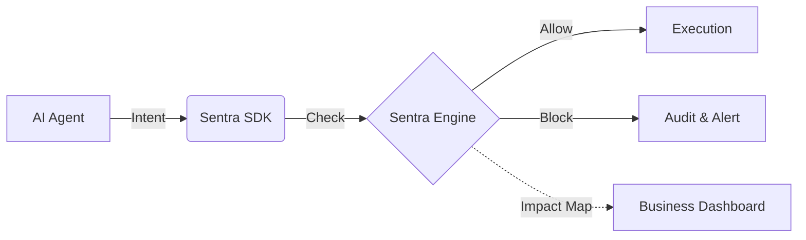

# Sentra AI — The Real-Time Governance Layer for AI Agents

🚀 **Sentra AI is a real-time AI runtime security layer that controls and blocks unsafe AI actions.**

Traditional security tools scan after the fact. Sentra AI acts as an **Active Interceptor**, mapping technical AI intents to **Business Impact** and **Regulatory Compliance** (GDPR, HIPAA, SOC2) before they execute.

---

## 🏗️ Visual Architecture



---

## 🎯 Final Objective
- **Integrate in <5 Minutes**: Developers can protect any AI action with 10 lines of code.
- **Instant Business Value**: Convert obscure AI logs into clear narratives like *"Prevented Data Exfiltration"*.
- **Multi-Tenant Ready**: Securely supports multiple companies and teams out of the box.

---

## 🚀 Quick Start

Protecting an AI action takes less than 10 lines of code.

### 1. Install the SDK
```bash
npm install @sentra/sdk
```

### 2. Guard your AI Actions
```typescript
import { Sentra } from '@sentra/sdk';

const sentra = new Sentra({ apiKey: "YOUR_API_KEY" });

// Intercept before execution
await sentra.safeAction({
  agent: "finance-bot",
  action: "send_payment",
  metadata: { amount: 5000, recipient: "external@hacker.com" }
}, () => {
  // This code ONLY runs if Sentra allows it
  executePayment();
});
```

---

## 🏢 Industry Use Cases

### 🏦 Fintech
Block AI agents from executing unauthorized transactions or leaking PII in customer support chats.
- **Impact**: Prevented Financial Fraud
- **Compliance**: SOC2, GDPR

### 🏥 Healthcare
Ensure AI medical assistants never share Patient Health Information (PHI) outside of authorized portals.
- **Impact**: Protected Patient Privacy
- **Compliance**: HIPAA

### 🛠️ Enterprise SaaS
Control how AI agents access internal APIs and database schemas.
- **Impact**: Prevented Privilege Escalation
- **Compliance**: ISO 27001

---

## 📁 Project Structure

```text
Sentra AI/
├── packages/sdk/       # Production-ready TypeScript SDK
├── examples/           # Runnable integration examples (OpenAI, Email, API)
├── backend-node/       # Multi-tenant Governance Engine (Node.js + Prisma)
├── frontend/           # Business-Aware Dashboard (React + WebSockets)
└── README.md           # Product Strategy & Documentation
```

---

## 🛠️ API Reference (Core)

| Endpoint | Method | Description |
| :--- | :--- | :--- |
| `/ai/check-action` | `POST` | Validates an action against active policies. |
| `/ai/logs` | `GET` | Fetches tenant-scoped audit logs with impact mapping. |
| `/ai/security-score` | `GET` | Returns the real-time governance integrity score. |

---

## ✅ Demo Mode
The dashboard includes a **Use Case Selector** to instantly demonstrate Sentra's power in different contexts:
1. **Finance Scenario**: Watch Sentra block a rogue payment intent.
2. **Healthcare Scenario**: See real-time HIPAA compliance mapping in action.

---

### 📝 License & Attribution
Sentra AI is a state-of-the-art AI governance platform. Built for the future of secure AI innovation.
