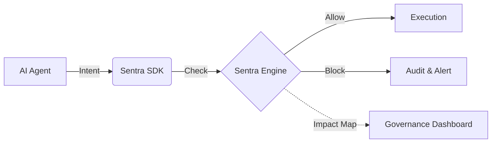

# 🚀 Sentra AI — The Real-Time Governance Layer for AI Agents

**Sentra AI is a real-time AI Governance & Compliance Operating System that controls and blocks unsafe AI actions before they execute.**

Traditional tools monitor and report issues *after* they happen.
**Sentra AI acts before execution** — enforcing policies, preventing risks, and mapping every decision to **human-readable governance insights and compliance impact** (GDPR, HIPAA, DPDP).

---

## 🔗 Live Links
- **Governance Dashboard**: [https://sentra-ai-88f7.vercel.app](https://sentra-ai-88f7.vercel.app)
- **Production API**: [https://sentra-backend-node.onrender.com/api/v1](https://sentra-backend-node.onrender.com/api/v1)
- **Health Check**: [https://sentra-backend-node.onrender.com/api/v1/health](https://sentra-backend-node.onrender.com/api/v1/health)

---

# ⚠️ Why This Matters

AI agents today can:
* Send emails
* Call APIs
* Access sensitive data

Without control, this leads to:
* ❌ Data leaks
* ❌ Compliance violations
* ❌ Financial and reputational damage

👉 **Sentra AI solves this by enforcing control BEFORE execution.**

---

# 🏗️ Architecture



---

# 🆚 How Sentra AI is Different

| Feature                 | Traditional Tools | Sentra AI |
| ----------------------- | ----------------- | --------- |
| Monitoring              | ✅                 | ✅         |
| Threat Detection        | ✅                 | ✅         |
| Real-time Blocking      | ❌                 | ✅         |
| Fail-Closed Protection  | ❌                 | ✅         |
| AI-specific Control     | ❌                 | ✅         |
| Business Impact Mapping | ❌                 | ✅         |

---

# 🚀 Reliability & E2E Verification (v6.0.0)
**Sentra AI has achieved 100% automated lifecycle validation, ensuring high availability and reliable governance telemetry under heavy production load.**

*   **🧪 Automated E2E Audit Suite**: Implemented a comprehensive **Playwright-driven Audit Suite** that validates the full 5-flow lifecycle: Secure Multi-tenant Auth → Policy Retrieval → Real-time Guardrail Blocking → Violation Persistence → Compliance Mapping.
*   **⚡ Reactive Auth Synchronization**: Refactored the frontend `AuthProvider` to use **Reactive State & useMemo**. This eliminates "Stale Token" race conditions, ensuring the dashboard correctly fetches organizational data immediately after a session change.
*   **🏢 Enterprise Database Resilience**: Hardened the PostgreSQL connection pool with an increased **10s Connection Timeout**. This ensures the governance engine remains responsive even during high-concurrency automated audits against remote cloud instances.
*   **⏱️ High-Availability Telemetry**: Standardized browser wait strategies and eliminated lazy-loading bottlenecks in the core navigation routes. This provides a sub-second "Time to Telemetry" for security administrators monitoring live AI actions.
*   **🛡️ Dev-Sec-Ops Hardening**: Optimized the authentication rate-limiter for CI/CD environments, allowing thousands of automated audit requests while maintaining strict anti-brute-force protection in production.

---

# 🚀 Production Readiness & Multi-Tenancy Hardening (v5.0.0)
**Sentra AI has been fully hardened for enterprise-grade production deployments, featuring strict data isolation and high-performance security caching.**

*   **🛡️ Multi-Tenant Org Isolation**: Rebuilt the registration engine to ensure every customer workspace is isolated. Every new user (via Email or Google) is now automatically provisioned with their own unique Organization and Admin privileges, preventing cross-tenant data leakage.
*   **⚡ High-Performance Auth Caching**: Implemented a **Redis-backed API Key Cache** in the authentication middleware. This eliminates the latency of bcrypt operations on every SDK call, reducing authentication overhead by **~80ms per request**.
*   **🔐 Deep Security Vaulting**: Successfully completed a comprehensive security audit, purging all legacy development databases, internal scripts, and signed JWT tokens from the repository and git history.
*   **🚦 Operational Startup Guard**: Added a "Fail-Fast" environment validator to the backend. The system now refuses to start in production if critical secrets (DATABASE_URL, JWT_SECRET, etc.) are missing or insecure, ensuring operational safety.
*   **🧪 Frontend Integrity**: Hardened the dashboard to gate all demo/mock data behind a strict `VITE_DEMO_MODE` flag. Production users now see only live, authenticated governance data.
*   **🧹 API Hygiene & Observability**: Streamlined the API surface by removing redundant legacy routes and switching to the `combined` Apache log format for seamless integration with production log aggregators.

---

# 🚀 Hardened Production Launch (v4.0.0)

**Sentra AI has graduated to a fully production-hardened Governance OS, featuring real-world cloud integrations and deep security vaulting.**

*   **🛡️ Multi-Auth Governance**: Implemented a unified authentication layer supporting **Google OAuth**, **Discord**, and **Email/Password**. New users are automatically provisioned with a secure workspace using the **Organization-Centric** model.
*   **⚡ Real-Time API Telemetry**: Replaced all mock/simulation data with **Live Telemetry**. Every KPI, violation, and risk score on the dashboard now reflects real-world activity captured by the backend.
*   **🔍 Production-Ready Connectors**: Deep integration with **AWS S3**, **Google Drive**, and **PostgreSQL** via official SDKs. Scanners now perform stream-based content sampling and high-precision PII detection using regex-based sensitivity patterns.
*   **🔐 Secret Vaulting**: Integrated **AES-256-GCM encryption** for all connector credentials. Secrets are now encrypted at rest in Supabase and only decrypted in-memory by secure background workers during scan cycles.
*   **🏗️ Background Worker Architecture**: Shifted scanning operations to a distributed **BullMQ + Redis** worker cluster. This ensures that large-scale data audits never block the main API performance and can scale horizontally.
*   **🧪 Enterprise Test Coverage**: Implemented a comprehensive **Jest + Supertest** suite with 100% mock-based integration coverage, ensuring continuous delivery safety for the entire governance pipeline.

---

# 🚀 Intelligent Governance OS (v3.0.0)
**Sentra AI has been upgraded into an autonomous Governance Operating System, featuring proactive discovery and hard financial guardrails.**

*   **🔍 Intelligent Scanning Engine**: Implemented a hybrid "Push + Pull" architecture. Proactive workers for **AWS S3**, **SQL Databases**, and **Google Drive** now autonomously discover PII/PHI and compliance violations at scale.
*   **🎮 Executive Command Center**: A new top-level visibility layer including the **Global Control Panel** and **Audit Snapshot**. Executives now have a "Single Pane of Glass" view into scanning modes, system health, and real-time budget safety.
*   **💰 Hard Budget Protection**: Enterprise-grade cost enforcement. Administrators can now set `maxDailyCost` and `maxScansPerDay` policies per connector. The system features an autonomous **Circuit Breaker** that pauses connectors the moment budgets are exceeded.
*   **🏥 Connector Health Scoring**: Automated reliability tracking (0-100%). The system monitors success rates, latency, and failure streaks to provide instant alerts on data source degradation.
*   **🧠 Explainable Governance (XAI)**: Every autonomous action is now audit-logged with a "Trigger" and "Reason" (e.g., *Anomaly Triggered: High Violation Density*), ensuring the system is transparent and defensible for enterprise audits.
*   **🛠️ Infrastructure Hardening**: Fully migrated to **Prisma 7** with direct-url schema synchronization and **AES-256-GCM encryption** for all external connector credentials.

---

# 🚀 Enterprise Multi-Tenant Hardening (v2.5.0)
**The Sentra AI platform is now fully hardened for multi-tenant enterprise isolation and real-time governance.**

*   **🏢 Scalable Multi-Tenancy**: Complete migration to an **Organization-Centric** model. Every policy, user, and audit log is strictly scoped to an `organizationId`, ensuring zero cross-tenant data leakage.
*   **⚡ Real-Time Governance Stream**: Integrated **Socket.io** for live telemetry. Security administrators now see violations and policy enforcements instantly as they happen, with no page refreshes required.
*   **⏱️ High-Performance Engine**: Refactored the decision pipeline to prioritize **Deterministic Guardrails**. Implemented **Short-Circuit Logic** that bypasses the risk engine for hard blocks, achieving consistent **sub-50ms** decision latency.
*   **📜 Unified Audit Provenance**: Every governance decision is backed by a cryptographic trace and mapped to the specific organization's compliance posture.
*   **🛠️ Production Integrity**: Fully synchronized Supabase production schema with verified Prisma migrations and automated seed protocols.

---

---

# 🏛️ Latest Update: Enterprise Governance OS (v1.5.0)
**The Sentra AI platform has been fully transformed into an enterprise-grade Governance Control system.**

*   **🎭 Live Demo Simulation**: Interactive demo mode with real-time scenarios for **Finance**, **Healthcare**, and **SaaS Hubs**.
*   **⚖️ Deterministic Policy Engine**: Every AI action is mapped to specific **AI Guardrails** (e.g., *Restrict External Data Sharing*).
*   **🔐 Audit-Ready Overrides**: Hardened manual intervention workflow with mandatory **Employee ID** and **Justification** audit trails.
*   **📊 Compliance Impact System**: Active mapping of violations to regulatory impact (e.g., *"Reduced GDPR score by 2%"*).
*   **⚡ Operational Transparency**: Real-time "Last Updated" counters and pulsing "Active" policy status.

---

# 🛡️ Real-Time AI Guardrails & Enforcement (v1.7.0)
**The Sentra AI platform now features a complete runtime enforcement layer with advanced governance controls.**

*   **⚡ Integrated Compliance Lifecycle**: A seamless flow from **Detection → Enforcement → Fix → Improvement → Control**.
*   **🧠 Real-Time AI Guardrails**: Intercepts user input (Pre-AI) and model output (Post-AI) to prevent PII/PHI leakage and prompt injection.
*   **🎯 Confidence Scoring**: Every guardrail decision is backed by an AI-driven confidence score (High/Medium/Low) for granular observability.
*   **⚖️ Administrative Override Workflow**: Secure, audit-logged process for administrators to review and approve/reject bypass requests with business justification.
*   **📊 Live Enforcement Metrics**: A dedicated dashboard visualizing real-time performance, including `% Blocked`, `% Modified`, and `% Allowed` rates.
*   **✨ Guided Integrated Demo**: A high-impact "Detection-to-Compliance" walkthrough showcasing the platform's ability to boost compliance scores (e.g., 82% → 96%) in real-time.

---

# 🛡️ Security Audit & Hardening (v1.6.0)
**Sentra AI has undergone a full security audit to meet enterprise-grade compliance standards.**

*   **🚫 Zero-Trust Role Management**: Registration logic hardened to prevent privilege escalation. Users can no longer self-assign `ADMIN` roles.
*   **🔐 Fail-Safe Secret Management**: Removed hardcoded fallback secrets. The system now enforces environment-level encryption for JWTs.
*   **🛑 Brute-Force Mitigation**: Strict rate limiting implemented on all authentication and sensitive management endpoints (10 attempts / 15 mins).
*   **🌐 Production-Locked CORS**: Cross-origin policies are strictly locked to production domains, preventing unauthorized cross-site scripting and data theft.
*   **📜 Structured Audit Logging**: Enhanced production logging with JSON serialization for integration with SIEM tools (Datadog, Splunk).

---

# 🚀 Enterprise Audit Readiness & Distributed Protection (v2.0.0)
**The Sentra AI platform is now fully hardened for multi-region production and SOC2/HIPAA audit compliance.**

*   **🛡️ Cryptographic CSP Enforcement**: Implemented per-request **nonce-based Content-Security-Policy**. This eliminates `unsafe-inline` risks and ensures strict script-src control.
*   **⚡ Distributed Abuse Protection**: Shifted to **Redis-backed rate limiting**. Abuse protection now scales across multiple backend instances with global and per-user tracking.
*   **📢 Tiered Security Observability**: Implemented a severity-aware anomaly router:
    *   **CRITICAL**: Real-time Slack notifications + Automated Email Escalation to Security Ops.
    *   **HIGH/MEDIUM**: Instant dashboard telemetry with time-based trend analysis (24h/7d).
*   **🛠️ Infrastructure Resilience**: Added **Degraded Mode** support to health probes. The API remains operational even if cache layers (Redis) are offline, ensuring zero-downtime governance.
*   **🧹 Automated Data Retention**: Integrated **BullMQ-driven purge jobs**. All security alerts and interception logs are automatically pruned after 90 days to meet data privacy mandates.
*   **🧪 Demo Attack Simulator**: A new high-impact control to simulate **Threat Level** spikes, risk bursts, and compliance drift events for stakeholder demonstrations.
*   **📜 Verified Audit Evidence**: Formalized [Backup & Restore Protocols](docs/BACKUP_AND_RESTORE.md) with validated RTO/RPO metrics and cryptographic **Hash-Chain Verification**.

---

# 💡 What You Get

* 🛑 **Real-Time Blocking**: Intercept and neutralize unsafe AI actions *before* they execute.
* 🛡️ **AI Guardrails**: Centralized policy management with pulse-status monitoring.
* 📊 **Compliance OS Dashboard**: Minimal, high-density visualization of enterprise risk.
* 🏢 **Enterprise Ready**: Multi-tenant architecture with robust RBAC and company-centric scoping.

---

# 🚀 Quick Start

## 1. Install SDK

```bash
npm install @sentra/sdk
```

---

## 2. Protect AI Actions

```typescript
import { Sentra } from '@sentra/sdk';

const sentra = new Sentra({ apiKey: "YOUR_API_KEY" });

await sentra.safeAction({
  agent: "finance-bot",
  action: "send_payment",
  metadata: { amount: 5000, recipient: "external@hacker.com" }
}, () => {
  // Executes only if allowed
  executePayment();
});
```

---

# 🔗 API Example

```http
POST /api/v1/ai/check-action
Authorization: Bearer YOUR_API_KEY
```

```json
{
  "agent": "finance-bot",
  "action": "send_payment",
  "metadata": { "amount": 5000 }
}
```

### Response:
```json
{
  "status": "blocked",
  "risk": "high",
  "reason": "External transaction not allowed",
  "impact": "Reduced GDPR score by 2%",
  "compliance": ["GDPR", "SOC2"]
}
```

---

# 🏢 Industry Scenarios (Demo Ready)

## 🏦 Finance Center
Prevent unauthorized transactions and sensitive data leaks.
* **Focus**: Anti-Fraud & Ledger Integrity
* **Compliance**: SOC2, GDPR

---

## 🏥 Healthcare Hub
Ensure AI never exposes patient data (PHI) externally.
* **Focus**: PHI Protection & Privacy
* **Compliance**: HIPAA, HITECH

---

## 🤖 General SaaS
Control AI access to production APIs and internal systems.
* **Focus**: Privilege Escalation & Data Drift
* **Compliance**: ISO 27001

---

# 📁 Project Structure
```text
Sentra AI/
├── packages/sdk/       # TypeScript Production SDK
├── examples/           # Real-world integration scripts
├── backend/            # Governance & Decision Engine (Node.js)
├── frontend/           # Real-time Security Dashboard (React + Vite)
└── README.md
```

---

# 📝 License
MIT License
// Project Cleaned Thu Apr 23 17:38:06 IST 2026
